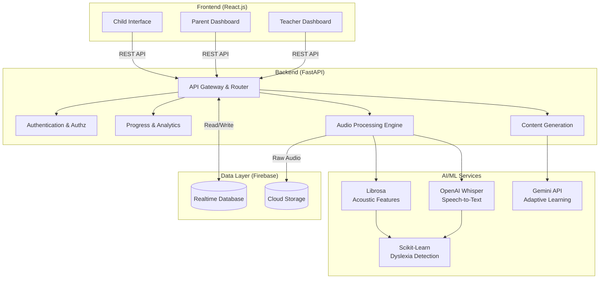

# Lumio Architecture

## 1. System Architecture

The Lumio platform follows a modern client-server architecture with specialized AI micro-services or modules for processing audio and personalizing learning.



## 2. Folder Structure

A monorepo approach is recommended for ease of development.

```text
lumio/
├── frontend/                 # React.js Application
│   ├── public/
│   ├── src/
│   │   ├── assets/           # Images, icons, audio assets
│   │   ├── components/       # Reusable UI components
│   │   │   ├── child/
│   │   │   ├── parent/
│   │   │   ├── teacher/
│   │   │   └── shared/
│   │   ├── pages/            # Page-level components
│   │   ├── services/         # API integration (Axios/Fetch)
│   │   ├── contexts/         # React Context (Auth, Theme)
│   │   ├── hooks/            # Custom React hooks
│   │   ├── utils/            # Helper functions
│   │   ├── App.js            # Main React Router setup
│   │   └── index.js
│   ├── package.json
│   └── .env
│
├── backend/                  # FastAPI Application
│   ├── app/
│   │   ├── api/
│   │   │   ├── routes/       # API endpoints (users, sessions, audio)
│   │   │   └── dependencies.py # Auth & DB dependencies
│   │   ├── core/             # Configuration & Security
│   │   ├── models/           # Pydantic models (Schemas)
│   │   ├── services/         # Business logic & AI orchestration
│   │   │   ├── ml_service.py # Integration with Scikit, Librosa
│   │   │   ├── llm_service.py # Integration with Gemini
│   │   │   └── stt_service.py # Integration with Whisper
│   │   ├── utils/
│   │   └── main.py           # FastAPI entry point
│   ├── requirements.txt
│   └── .env
│
└── ml_models/                # ML training and exploration
    ├── notebooks/            # Jupyter notebooks for model training
    ├── data/                 # Sample datasets
    └── saved_models/         # Pickled Scikit-Learn models (.pkl)
```

## 3. Module Breakdown

### Frontend Modules
*   **Authentication Module:** Handles login/signup for different roles (Child, Parent, Teacher).
*   **Child Interface:**
    *   **Game Engine/Canvas:** Interactive reading and spelling exercises.
    *   **Voice Recorder:** Captures child's reading audio for analysis.
    *   **Rewards System:** Gamification (badges, points) to keep engagement high.
*   **Parent Dashboard:**
    *   **Progress Tracker:** Visualizes reading metrics (WPM, accuracy) using Chart.js.
    *   **Alerts & Insights:** Notifications on potential dyslexia markers and suggested interventions.
*   **Teacher Dashboard:**
    *   **Classroom Management:** View all students, group them, and assign targeted tasks.
    *   **Aggregate Analytics:** Class-wide performance charts to identify trends.

### Backend Modules
*   **User Management:** Role-based access control (RBAC) ensuring data privacy.
*   **Assessment Engine:** Orchestrates the flow of a reading test or learning module.
*   **Audio Analysis Pipeline:**
    *   Receives audio from the frontend and saves it to Firebase Storage.
    *   Extracts text transcript and timing via OpenAI Whisper.
    *   Extracts acoustic features (hesitations, phoneme gaps, spectral features) via Librosa.
    *   Passes combined features to a trained Scikit-Learn model to output a dyslexia risk/confidence score.
*   **Content Generation Pipeline:** Uses the Gemini API to dynamically generate personalized reading passages focused on the specific phonemes or words a child struggles with.

## 4. Database Design (Firebase Realtime Database)

The NoSQL structure is designed to be relatively flat and optimized for real-time reads and UI subscriptions.

```json
{
  "users": {
    "userId_1": {
      "role": "parent",
      "name": "John Doe",
      "email": "john@example.com",
      "children": ["childId_1", "childId_2"]
    },
    "userId_2": {
      "role": "teacher",
      "name": "Mrs. Smith",
      "school": "Lincoln Elementary",
      "students": ["childId_1", "childId_3"]
    }
  },
  "children": {
    "childId_1": {
      "parentId": "userId_1",
      "teacherId": "userId_2",
      "name": "Timmy",
      "age": 7,
      "level": "beginner",
      "totalPoints": 450,
      "weakPhonemes": ["b", "d"]
    }
  },
  "sessions": {
    "sessionId_1": {
      "childId": "childId_1",
      "timestamp": 1693567890,
      "taskType": "reading_aloud",
      "audioUrl": "gs://lumio.appspot.com/audio/session_1.wav",
      "metrics": {
        "wpm": 45,
        "accuracy": 88,
        "hesitationCount": 4
      },
      "dyslexiaRiskScore": 0.35,
      "transcription": "The quick brown fox..."
    }
  },
  "assignments": {
    "assignmentId_1": {
      "teacherId": "userId_2",
      "assignedTo": ["childId_1", "childId_3"],
      "contentId": "contentId_5",
      "dueDate": 1694000000,
      "status": "pending"
    }
  }
}
```

## 5. API Design

RESTful endpoints exposed by the FastAPI backend to interface with the frontend.

### Auth & Users
*   `POST /api/auth/register` - Register a new parent or teacher.
*   `POST /api/auth/login` - Authenticate and receive JWT token.
*   `GET /api/users/me` - Get current user profile details.
*   `POST /api/children` - Add a new child profile (accessible by Parent/Teacher).
*   `GET /api/children/{child_id}` - Get specific child details.

### Assessments & Audio Processing
*   `POST /api/sessions/start` - Initialize a learning/reading session.
*   `POST /api/sessions/{session_id}/upload-audio` - Upload audio chunk, triggers the AI processing pipeline.
    *   *Process Flow:* Saves to Storage -> Whisper STT -> Librosa feature extraction -> Scikit-Learn inference -> Updates DB.
*   `GET /api/sessions/{session_id}/results` - Get the analyzed results and metrics of a session.

### Analytics & Dashboards
*   `GET /api/analytics/child/{child_id}` - Fetch historical session data formatted for Chart.js (Parent view).
*   `GET /api/analytics/teacher/class` - Fetch aggregated class data and risk alerts (Teacher view).

### AI Content Generation
*   `POST /api/content/generate` - Trigger Gemini API to create a custom story based on a child's `weakPhonemes` and recent performance profile.
